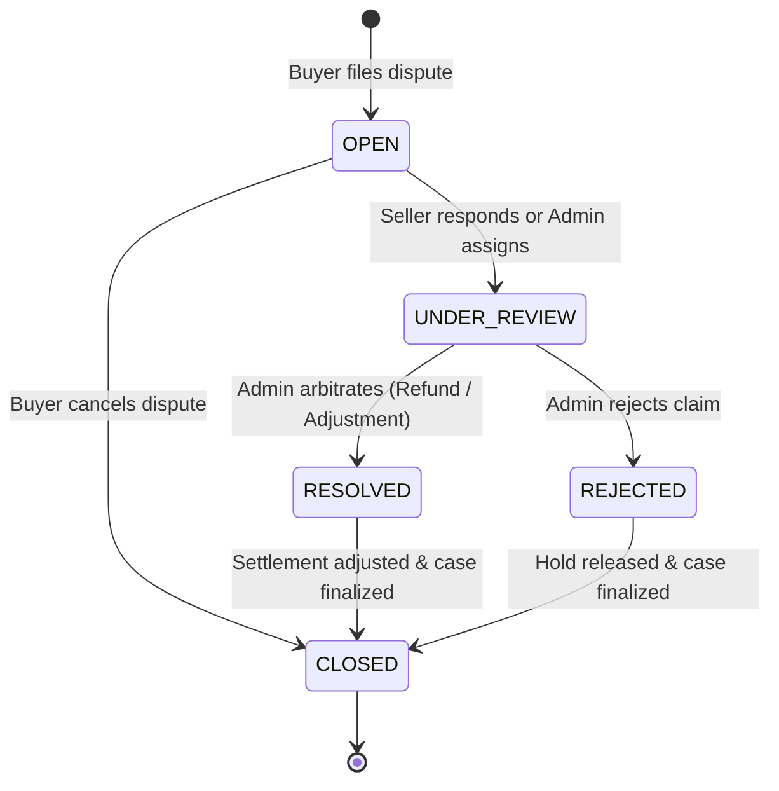

# AgroMarket — Disputes, Quality Claims & Arbitration Architecture

## Overview
In an agricultural marketplace dealing in perishable food products, grains, tubers, livestock, and bulk farm inputs across Nigeria, delivery condition, post-harvest rot, transit damage, and weighbridge shortages are inherent risks.

AgroMarket Phase 0.8 implements a robust, server-authoritative **Disputes & Arbitration Engine**.

---

## 1. Domain Principles

1. **Multi-Seller Isolation**:
   In a multi-seller order where a buyer purchases from Farmer A (Sokoto Onions) and Farmer B (Benue Yam), disputes are strictly partitioned by `seller_id` (and optionally `order_item_id`). Farmer A cannot see Farmer B's dispute or financial data.
2. **Server-Authoritative Amounts**:
   Disputed amounts and refund allowances are strictly validated and derived on the server from immutable order snapshots. Clients cannot dictate arbitrary dispute amounts.
3. **Escrow & Fulfillment Holds**:
   Opening a dispute places an automatic hold on the target seller's settlement ledger for that consignment, preventing release of funds until the issue is arbitrated or withdrawn.
4. **Anti-Pork Produce Prohibition**:
   In strict adherence to platform standards, pork or prohibited produce is banned across all dispute claims, product seeds, and manifests.
5. **Pure NGN Fiat**:
   All financial claims, balances, and refunds operate exclusively in Nigerian Naira (NGN). Crypto assets and non-fiat tokens are strictly prohibited.

---

## 2. Dispute State Machine

### Dispute Statuses
- **`OPEN`**: Initiated by buyer upon delivery receipt. Seller has been notified and may submit a defense statement or offer a settlement.
- **`UNDER_REVIEW`**: Active statement submitted or under formal review by an AgroMarket compliance arbitrator.
- **`RESOLVED`**: Admin has arbitrated the dispute with a formal decision (`BUYER_REFUND`, `PARTIAL_REFUND`, `SELLER_SETTLEMENT`, `REPLACEMENT`, or `NO_ACTION`).
- **`REJECTED`**: Claim investigated and deemed unfounded. No refund is granted; fulfillment hold on the seller is released.
- **`CLOSED`**: Terminal state. All accounting adjustments have taken effect.

---

## 3. Dispute Categories
- `ITEM_NOT_RECEIVED`: Consignment missing from delivery.
- `DAMAGED_ITEM`: Perishable produce arrived crushed, bruised, or spoiled in transit.
- `QUALITY_ISSUE`: Moisture content, grade, or pest infestation below agreed catalog specifications.
- `MISSING_QUANTITY`: Weighbridge deficit or count shortage.
- `WRONG_ITEM`: Produce variety delivered differs from listing.
- `DELIVERY_FAILURE`: Carrier failure or logistics abandonment.
- `OTHER`: Uncategorized fulfillment exceptions.

---

## 4. Evidence Repository
Dispute evidence is immutably linked to the case via the `dispute_evidence` table.
Supported evidence types include:
- `PHOTO`: Produce inspection snapshots, transit crates, rot.
- `DELIVERY_PROOF`: Waybills, delivery receipts, driver signatures.
- `DOCUMENT`: Certified weighbridge certificates, moisture test readings.
- `VIDEO`: Unloading footage.
- `CHAT_REFERENCE`: Relevant farmer/buyer communication excerpts.

---

## 5. Gateway Refund Orchestration
When an administrator awards a refund (`BUYER_REFUND` or `PARTIAL_REFUND`), the system:
1. Verifies that cumulative refunds do not exceed the original order total (`sum(refunds) <= order.total_amount`).
2. Creates an idempotent record in `public.refunds` (`PENDING`).
3. Invokes the payment provider refund adapter (`Paystack` or `Flutterwave`) with an idempotent reference.
4. Marks the refund as `SUCCEEDED` upon gateway confirmation.
5. Deducts the refunded amount from the seller's settlement ledger via `SettlementService.applyDisputeAdjustment()`.
6. Generates immutable audit logs and alerts both parties.
