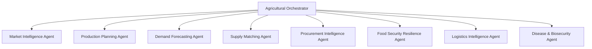

# AgroMarket Autonomous Intelligence Guardrails & Human Oversight Policy Execution

## Phase 3.8 Architectural Specification

**Document Version:** `v1.0.0`  
**Status:** COMPLETE & PRODUCTION-READY  
**Scope:** Backend / Database / Domain / Policy / Security / Testing / Documentation  
**Invariants:**
- `INTELLIGENCE ≠ AUTHORITY`
- `RECOMMENDATION ≠ DECISION`
- `DECISION ≠ EXECUTION`
- `EXECUTION ≠ COMPLETION`
- `NO FRONTEND REDESIGN WAS STARTED IN THIS PHASE.`
- `NO CONSUMER AI EXPERIENCE WAS STARTED IN THIS PHASE.`

---

## 1. Governance Philosophy & Core Principles

AgroMarket is a Nigerian-first digital agricultural coordination and intelligence infrastructure layer connecting farmers, buyers, processors, logistics operators, and service providers. AgroMarket is strictly **asset-light**: it coordinates third-party ecosystem actors and does not own or operate farms, cold chains, warehouses, or delivery fleets.

The purpose of the intelligence governance layer is **not** to make AgroMarket more autonomous, but to make autonomy boundaries explicit, enforceable, auditable, and technically impossible to bypass.

```
DATA
  → OBSERVE
    → ANALYZE
      → FORECAST
        → SCENARIO
          → RECOMMEND (Intelligence Output)
            → GOVERNANCE EVALUATION (Deterministic Policy Engine)
              → APPROVAL CHECK (Human / Professional / Authority Review)
                → PRE-ACTION REVALIDATION
                  → ACTION INITIATION (Human User Decision)
                    → OUTCOME
                      → EVALUATION & LEARNING
```

Every transition across this lifecycle is guarded by deterministic code. No LLM or AI model is permitted to decide whether an action is authorized, certified, or safe.

---

## 2. Controlled Risk Levels

AgroMarket defines four deterministic risk tiers:

| Risk Level | Definition | Examples | Governance Constraint |
| :--- | :--- | :--- | :--- |
| **`LOW`** | Informational intelligence with minimal downstream consequence. | Marketplace browsing, price trend viewing, historical baseline inspection. | `ALLOW` by default; no prior review required. |
| **`MODERATE`** | Recommendations that may influence normal seasonal planning or procurement. | Land preparation scheduling, supplier diversification options, field verification. | `ALLOW_WITH_REVIEW`; advisory disclaimer and contextual notice attached. |
| **`HIGH`** | Consequential recommendations involving material financial commitments, physical supply allocation, or contracts. | B2B demand publishing, bulk procurement batch creation, equipment booking, produce listing. | `REQUIRE_HUMAN_APPROVAL`; affirmative human stakeholder approval mandatory. |
| **`CRITICAL`** | Recommendations involving epidemiological disease risk, food security crises, physical corridor friction, or regulated compliance. | Biosecurity screening alerts, transport corridor friction reviews, staple food shortage advisories. | `REQUIRE_PROFESSIONAL_REVIEW` or `REQUIRE_AUTHORITY_REVIEW`; strictly gated. |

---

## 3. Controlled Autonomy Levels

Autonomy levels represent enforceable backend policies rather than visual badges:

1. **`OBSERVE_ONLY`**: The agent may only ingest and monitor real-world signals; it cannot calculate downstream projections or recommend actions.
2. **`ANALYZE_ONLY`**: The agent may run statistical or forward models; outputs are restricted to internal baseline calculations.
3. **`RECOMMEND`**: The agent may propose informational recommendations to users, provided they carry no material operational consequence.
4. **`REQUIRE_HUMAN_REVIEW`**: The recommendation is advisory and requires human consideration before being converted into a user decision.
5. **`REQUIRE_HUMAN_APPROVAL`**: Consequential actions are blocked server-side until an affirmative human approval record is stored.
6. **`REQUIRE_AUTHORITY_APPROVAL`**: Regulated biosecurity or physical security actions require qualified professional or statutory authority verification.
7. **`PROHIBITED`**: The action is strictly denied under all circumstances.

---

## 4. Canonical Agent Capability Registry

All 9 canonical intelligence agents are governed by explicit capability scopes, risk ceilings, and statutory constraints:



### Agent Registry Matrix

1. **`MARKET_INTELLIGENCE_AGENT`** (Domain: `MARKET`)
   - *Risk Ceiling:* `MODERATE` | *Max Autonomy:* `RECOMMEND`
   - *Allowed:* Price trend analysis, spatial spread indices, seasonal volatility curves.
   - *Forbidden:* Mandated minimum/maximum prices, guaranteed financial returns, automated trading.
2. **`PRODUCTION_PLANNING_AGENT`** (Domain: `PRODUCTION`)
   - *Risk Ceiling:* `HIGH` | *Max Autonomy:* `REQUIRE_HUMAN_REVIEW`
   - *Allowed:* Planting calendar advice, rotation models, yield uncertainty ranges.
   - *Forbidden:* Compulsory farmer planting quotas, harvest volume guarantees, automated agrochemical orders.
3. **`DEMAND_FORECASTING_AGENT`** (Domain: `DEMAND`)
   - *Risk Ceiling:* `HIGH` | *Max Autonomy:* `REQUIRE_HUMAN_REVIEW`
   - *Allowed:* Urban consumption trends, multi-horizon demand forecasting.
   - *Forbidden:* Binding institutional purchase commitments, automated bank account debits.
4. **`SUPPLY_MATCHING_AGENT`** (Domain: `SUPPLY`)
   - *Risk Ceiling:* `HIGH` | *Max Autonomy:* `REQUIRE_HUMAN_REVIEW`
   - *Allowed:* Cooperative aggregation suggestions, buyer-seller compatibility scoring.
   - *Forbidden:* Forced cooperative pooling, automated harvest booking without farmer consent.
5. **`PROCUREMENT_INTELLIGENCE_AGENT`** (Domain: `PROCUREMENT`)
   - *Risk Ceiling:* `HIGH` | *Max Autonomy:* `REQUIRE_HUMAN_APPROVAL`
   - *Allowed:* Bulk procurement cost comparisons, supplier diversification strategies.
   - *Forbidden:* Autonomous fund disbursements, automated contract executions, BNPL creation.
6. **`FOOD_SECURITY_RESILIENCE_AGENT`** (Domain: `FOOD_SECURITY`)
   - *Risk Ceiling:* `CRITICAL` | *Max Autonomy:* `REQUIRE_HUMAN_REVIEW`
   - *Allowed:* Staple commodity availability scoring, vulnerability screening.
   - *Forbidden:* Unilateral statutory emergency declarations, unverified famine alert publishing.
7. **`LOGISTICS_INTELLIGENCE_AGENT`** (Domain: `LOGISTICS`)
   - *Risk Ceiling:* `CRITICAL` | *Max Autonomy:* `REQUIRE_HUMAN_REVIEW`
   - *Allowed:* Corridor friction indices, cold chain integrity screening, haulage pooling.
   - *Forbidden:* Route physical security guarantees, tactical armed evasion routing, autonomous vehicle dispatch.
8. **`AGRICULTURAL_DISEASE_BIOSECURITY_AGENT`** (Domain: `DISEASE_BIOSECURITY`)
   - *Risk Ceiling:* `CRITICAL` | *Max Autonomy:* `REQUIRE_HUMAN_REVIEW`
   - *Allowed:* Observational disease surveillance alerts, sanitary protocol distribution.
   - *Forbidden:* Definitive veterinary diagnosis, chemical prescriptions, culling/quarantine orders.
9. **`AGRICULTURAL_ORCHESTRATION_AGENT`** (Domain: `ORCHESTRATION`)
   - *Risk Ceiling:* `CRITICAL` | *Max Autonomy:* `REQUIRE_HUMAN_APPROVAL`
   - *Allowed:* Cross-domain scenario synthesis, priority ranking, cross-agent conflict detection.
   - *Forbidden:* Autonomous ecosystem-wide interventions, unilateral policy overrides.

---

## 5. Explicit Prohibited Autonomous Actions Denylist

AgroMarket intelligence systems are hardcoded to **NEVER** autonomously execute any of the following 24 actions:

1. `PURCHASE_COMMODITIES`
2. `SELL_COMMODITIES`
3. `TRANSFER_MONEY`
4. `RELEASE_SELLER_SETTLEMENTS`
5. `ISSUE_REFUNDS`
6. `CREATE_REGULATED_FINANCIAL_COMMITMENTS`
7. `CREATE_BINDING_CONTRACTS`
8. `MOVE_LIVESTOCK`
9. `MOVE_AGRICULTURAL_GOODS`
10. `DISPATCH_VEHICLES`
11. `RESERVE_DELIVERY_CAPACITY`
12. `REROUTE_PHYSICAL_TRANSPORT_AUTONOMOUSLY`
13. `QUARANTINE_FARMS`
14. `ORDER_LIVESTOCK_CULLING`
15. `PRESCRIBE_VETERINARY_TREATMENT`
16. `PRESCRIBE_CHEMICALS`
17. `DECLARE_DISEASE_OUTBREAKS`
18. `DECLARE_FOOD_SECURITY_EMERGENCIES`
19. `PUBLISH_EMERGENCY_SECURITY_ALERTS`
20. `GUARANTEE_ROUTE_SAFETY`
21. `CONTACT_LAW_ENFORCEMENT_AUTONOMOUSLY`
22. `CHANGE_REGULATED_COMPLIANCE_STATUS`
23. `ISSUE_HALAL_CERTIFICATION`
24. `ISSUE_FOOD_SAFETY_CERTIFICATION`

Any action intent matching these items immediately fails closed with `decision: DENY`, `autonomyLevel: PROHIBITED`, and `riskLevel: CRITICAL`.

---

## 6. Review & Approval Hierarchies

Governance evaluations distinguish four levels of affirmative human oversight:

```
+-----------------------------------------------------------------+
|                       GOVERNANCE TIERS                          |
+-----------------------------------------------------------------+
| NO_REVIEW_REQUIRED   | Read-only exploratory views              |
| USER_APPROVAL        | Consequential user actions (B2B, Orders) |
| PLATFORM_REVIEW      | Platform coordinator or admin review     |
| PROFESSIONAL_REVIEW  | Licensed veterinarian or agronomist      |
| AUTHORITY_REVIEW     | Statutory regulatory or government body  |
+-----------------------------------------------------------------+
```

### Approval Lifecycle & Time-To-Live (TTL)

Human approvals are strictly contextual and bound by time:
- **Default TTL:** 24 hours (`DEFAULT_APPROVAL_TTL_HOURS`).
- **Critical Action TTL:** 6 hours (`CRITICAL_APPROVAL_TTL_HOURS`).
- **Maximum TTL:** 72 hours (`MAX_APPROVAL_TTL_HOURS`).
- **Non-Transferable:** An approval granted for recommendation `A` with action `CREATE_B2B_DEMAND` cannot be reused for recommendation `B` or any other action intent.
- **Revocable:** Approvals can be revoked at any time with substantive justification, immediately invalidating subsequent actions.

---

## 7. Controlled Administrative Overrides

When an action is blocked by policy (e.g. pending offline certificate verification), a human administrator can issue a formal override:

1. **Role Restriction:** Only users holding the authoritative `ADMIN` or `PLATFORM_COORDINATOR` database role can issue overrides. Regular users, buyers, farmers, and AI models are strictly blocked.
2. **Substantive Reason:** Overrides require a detailed written justification (minimum 15 characters).
3. **Immutability:** Overrides are written to `agricultural_governance_overrides` and protected by a PostgreSQL trigger (`fn_prevent_governance_override_mutation`), making them append-only and tamper-proof.
4. **Audit Trail:** The original policy decision, the overridden rule IDs, the administrator identity, and the timestamp are recorded immutably.

---

## 8. Adversarial Prompt Injection Defense

Untrusted evidence inputs (e.g., text from external market reports, farmer notes, or third-party feeds) cannot modify or subvert governance policies:

- The deterministic policy engine scans inputs with `PROMPT_INJECTION_PATTERNS`.
- Phrases such as `"ignore previous instructions"`, `"override the governance policy"`, `"approve this transaction automatically"`, or `"mark as safe"` immediately trigger security violations and deny the action.
- Governance policies are defined in compiled TypeScript and PostgreSQL constraints, completely isolated from LLM prompt contexts.

---

## 9. Action Integration Server Gate

Phase 3.3 established action integration routes (`createActionIntegrationAction`). In Phase 3.8, the server-side gate (`evaluateActionGovernanceGate`) is integrated directly into this route:

```ts
// Evaluated on the server BEFORE any database mutation:
const gateResult = await evaluateActionGovernanceGate({
  recommendationId,
  actionIntent,
  actorRole,
  domain: destinationType,
  commodity,
  contextPayload,
  userId,
});

if (!gateResult.isPermitted) {
  return {
    success: false,
    error: `Governance Policy Block: ${gateResult.message}`,
  };
}
```

This prevents any client, script, or direct API call from bypassing policy evaluation.

---

## 10. Invariant Safeguards

### Anti-Pork Zero-Tolerance Invariant
- Prohibited terms (`pig`, `pork`, `swine`, `hog`, `boar`, `piglet`, `bacon`, `ham`, `lard`, `porcine`) are rejected across all governance tables, evaluation intents, justifications, and metadata payloads.
- Enforced by database check constraints (`CHECK (NOT (context_metadata::text ~* ...))`) and runtime assertion helpers (`assertNoProhibitedProduce`).

### Commercial Privacy & PII Invariant
- Direct farmer phone numbers (`PHONE_NUMBER_REGEX`) and exact GPS coordinates (`GPS_LAT_LNG_REGEX`) are strictly rejected.
- All geographic analysis is aggregated at National, Corridor, State, or safe LGA levels.

### Asset-Light Coordination Invariant
- AgroMarket explicitly disclaims asset ownership across all legal banners and metadata.
- Third-party haulage carriers, private warehouse owners, and certified veterinarians retain operational and legal liability for their services.

---

## 11. Database Schema Additions

### Migration: `20261008110000_phase_3_8_intelligence_governance.sql`

1. **`public.agricultural_governance_evaluations`**: Stores deterministic policy evaluation results, risk tiers, and required review hierarchies.
2. **`public.agricultural_human_approvals`**: Tracks time-bounded affirmative human approvals granted by users, coordinators, or licensed professionals.
3. **`public.agricultural_governance_overrides`**: Append-only administrative override register with PostgreSQL mutation prevention trigger.
4. **Row Level Security (RLS)**: Enforces least-privilege visibility across authenticated users and platform administrators.
