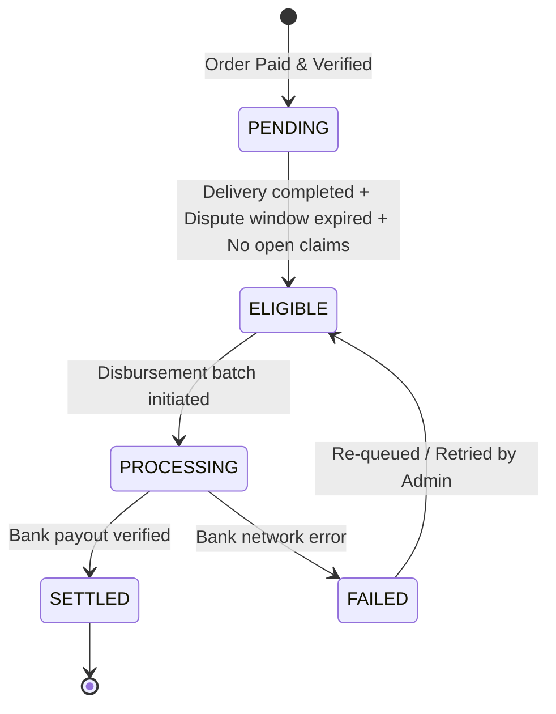

# AgroMarket — Multi-Seller Settlement Accounting & Fulfilment Holds

## Overview
AgroMarket is a multi-seller agricultural marketplace. When a buyer pays for an order containing produce from multiple independent Nigerian farmers and logistics carriers, the funds are held securely until delivery is completed and quality is verified.

Phase 0.8 implements **Settlement Accounting & Fulfilment Holds**.

> **Legal Clarity**: AgroMarket is not a licensed escrow bank or trustee. Holds are internal fulfillment milestones and dispute eligibility controls designed to maintain platform trust between farmers and buyers.

---

## 1. Multi-Seller Partitioning

An order with $N$ independent farmers automatically produces $N$ distinct settlement records in `public.settlements`:

$$\text{Order} \implies \{\text{Settlement}_{\text{Seller}_1}, \text{Settlement}_{\text{Seller}_2}, \dots, \text{Settlement}_{\text{Seller}_N}\}$$

### Database Invariant
```sql
CONSTRAINT uq_settlement_order_seller UNIQUE (order_id, seller_id)
```
This guarantees that each seller has exactly one isolated accounting ledger per order.

---

## 2. Settlement Calculation Formula

The net payout to any farmer is calculated strictly on the server:

$$\text{Net} = \text{Gross} - \text{Platform Fee} - \text{Logistics Adj} - \text{Refund Deductions} - \text{Dispute Adjustments}$$

- **Gross Amount**: Sum of all line item totals (`total_price`) for that seller in the order.
- **Platform Fee**: Configurable percentage (`DEFAULT_PLATFORM_FEE_PERCENT = 0` by default; no arbitrary fees invented).
- **Logistics Adjustment**: Any carrier deductions assigned to the seller.
- **Refund Deductions**: Automated refunds granted to the buyer for issues attributable to the seller.
- **Dispute Adjustments**: Administrative arbitration penalties or concessions.

All amounts are strictly bounded such that $\text{Net} \ge 0$.

---

## 3. Fulfilment Hold State Machine



### Settlement Statuses
- **`PENDING`**: Consignment in transit, awaiting buyer delivery confirmation, or in the mandatory 7-day inspection window (`DEFAULT_DISPUTE_WINDOW_DAYS = 7`).
- **`ELIGIBLE`**: All fulfillment milestones reached. Safe for payout disbursement.
- **`PROCESSING`**: Transfer instruction issued to the Nigerian payment/payout gateway.
- **`SETTLED`**: Payout successfully credited to the farmer's registered Nigerian bank account.
- **`FAILED`**: Payout transfer failed due to invalid NUBAN, bank outage, or gateway error. Flagged for admin retry.

---

## 4. Eligibility Evaluation Rules

A settlement record transitions from `PENDING` to `ELIGIBLE` if and only if **all** of the following conditions hold:

1. **Payment Verified**: The parent order has received verified payment (order status is `PAID`, `PROCESSING`, `PARTIALLY_FULFILLED`, or `COMPLETED`). In a multi-seller order, a seller whose consignment is delivered does not wait for unrelated sellers to finish processing.
2. **Consignment Delivered**: All delivery consignments for this seller have reached status `DELIVERED` with `actual_delivery_date` populated.
3. **No Carrier Failure**: No delivery consignment for this seller is in `DELIVERY_FAILED` state.
4. **No Active Disputes**: Zero disputes for this `(order_id, seller_id)` are in `OPEN` or `UNDER_REVIEW` state.
5. **Dispute Window Expired**: $\text{Current Time} \ge \text{Latest Delivery Time} + 7 \text{ days}$.

If any condition is not met, the settlement remains in `PENDING` with a descriptive `hold_reason` (e.g., *"Quality inspection window active until 2026-09-19"*, *"Delivery failure recorded"*, or *"Open dispute case #3b8e1f02 under review"*).

Settlement transitions do not affect master order status; master order completion remains governed strictly by full delivery of all consignments.

---

## 5. Security & Isolation

- **Row Level Security (RLS)**:
  Farmers have `SELECT` access exclusively where `seller_id = auth.uid()`. They cannot inspect another farmer's gross revenue, fees, or payouts.
- **Admin RBAC**:
  Only users with verified `ADMIN` role can execute disbursements, force eligibility overrides, or retry failed payouts.
- **Audit Logging**:
  Every eligibility transition, status change, and dispute adjustment records an immutable audit entry in `public.audit_logs`.
