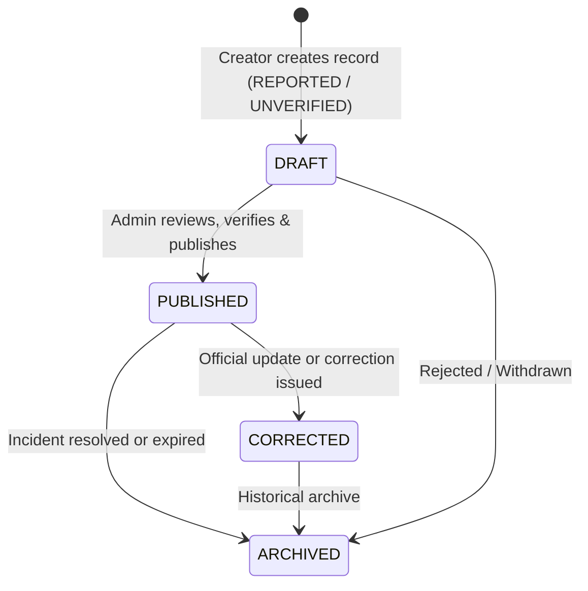

# Agricultural Security & Food Security Domain (Phase 1.5)

## 1. Domain Overview
The **Agricultural Security & Food Security** domain provides digital coordination and decision-support intelligence for physical security disruptions affecting Nigerian farming communities and agricultural transit corridors.

AgroMarket is an asset-light digital platform. It does **not** operate private security, provide armed convoys, or guarantee roadway safety. Instead, it provides structured, transparent, and attributed information to help farmers, logistics operators, and food buyers make safer, data-informed operational plans.

---

## 2. Core Principles
1. **Decision Support Only**: Information is for awareness and agricultural planning. Clear disclaimers accompany all notices.
2. **Strict Location Privacy**: Exact farm GPS coordinates and private farmstead addresses are strictly prohibited. Scope is limited to LGA, State, or regional transport corridors to safeguard vulnerable growers.
3. **Information Quality & Verification Control**: Public notices clearly distinguish between unverified reports, sourced media, verified incidents, and official security agency bulletins.
4. **Fact vs. Analysis Separation**: Observed logistical/market conditions are strictly decoupled from editorial inferences. No unsupported causal assertions are permitted.
5. **Security-Aware Logistics**: Read-only contextual corridor alerts inform transporters of active disruptions without mutating delivery records or offering false security guarantees.
6. **Strict Anti-Pork Policy**: All security content, affected commodity tags, and impact notes are strictly validated against prohibited pork/pig produce.
7. **No Fake Data**: When no verified disruptions are active in an area, the system renders an honest empty state: *"No verified agricultural security incidents are currently published for this area."*

---

## 3. Incident Lifecycle & Statuses

### Verification Statuses:
- `UNVERIFIED`: Field report without independent corroboration.
- `REPORTED`: Ingested into editorial queue under review.
- `VERIFIED`: Corroborated by reliable field partners or credible media.
- `OFFICIAL`: Published directly by or confirmed with state police, military, NEMA, or ministry authorities.
- `CORRECTED`: Amended after new factual evidence emerged.
- `ARCHIVED`: Historical record retained for trend audit.

---

## 4. Controlled Incident Types
- `FARM_ATTACK`
- `KIDNAPPING_SECURITY_THREAT`
- `FARM_ACCESS_DISRUPTION`
- `LOGISTICS_CORRIDOR_INCIDENT`
- `THEFT_OR_ROBBERY`
- `MOVEMENT_RESTRICTION`
- `AGRICULTURAL_MARKET_DISRUPTION`
- `OTHER_AGRICULTURAL_SECURITY_EVENT`

---

## 5. Security-Aware Logistics Relationship
When logistics carriers or farmers review consignments in `/logistics/deliveries` or `/logistics/deliveries/[deliveryId]`:
- The system queries `getActiveLogisticsCorridorAdvisories` matching the involved states.
- If disruptions exist, a prominent non-intrusive advisory banner highlights affected corridors, movement restrictions, and links to official state notices.
- Actual delivery tracking state (`PENDING`, `PICKED_UP`, `IN_TRANSIT`, `DELIVERED`) remains isolated under logistics authority.

---

## 6. Future Extension Points
- Corridor subscription and SMS/WhatsApp broadcast alerts for registered transport cooperatives.
- Granular aggregation with market intelligence price spikes in Phase 2.
- Crowdsourced farmer cooperative validation workflows.
